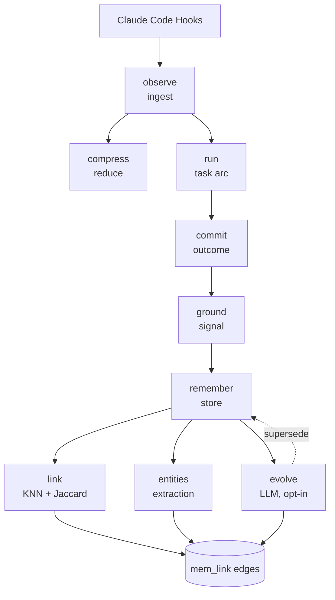
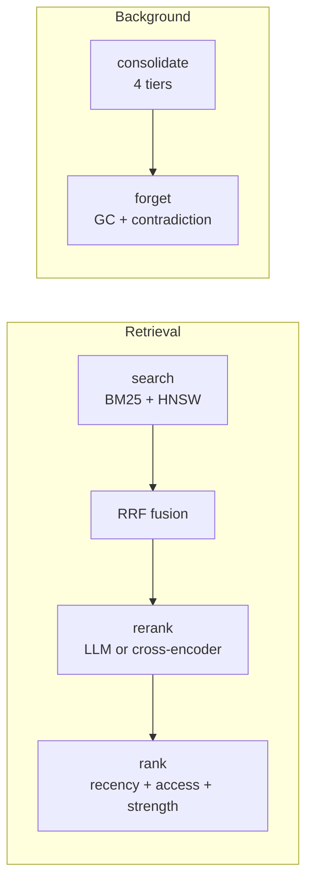

# hifz Architecture

Persistent memory for Claude Code. Hooks capture what happens during a session, memories store what matters long-term, and a grounding loop ties memories to real outcomes (commits).





---

## Observation Pipeline

**Hook → observe → compress → store → run::append**

Claude Code fires shell hooks on events: `SessionStart`, `UserPromptSubmit`, `PostToolUse`, `Stop`, `TaskCompleted`, `SessionEnd`. Each hook POSTs a JSON payload to `/hifz/observe`.

### observe.rs

Entry point for all incoming data. Handles run lifecycle before dedup so lifecycle events are never dropped:

- `prompt_submit` → creates a new run via `run::start`
- `Stop` / `TaskCompleted` → closes the open run via `run::close`

Then: dedup check (hash of session_id + tool_name + tool_input) → compression → embedding → store observation → append to open run.

Git commit detection runs last: if the Bash tool output matches `[branch sha] message`, it records a commit and links it to the run.

### compress.rs

Reduces raw hook payloads into structured observations: title, narrative, facts, concepts, files, importance score. Two modes:

- **Synthetic** (default): regex/heuristic extraction, no LLM
- **LLM** (opt-in): Ollama summarization with synthetic fallback

### run.rs

A task-scoped trajectory: one user prompt through to completion. Spans `UserPromptSubmit → Stop/TaskCompleted`. Tracks which observations belong to which task, and can derive a lesson from its highest-importance observations.

---

## Memory System

### Embeddings

All embeddings use **fastembed AllMiniLM-L6-V2** (384 dimensions, runs locally via ONNX — no API calls). The text fed into the model differs by record type:

| Record | Embed input | Where |
|--------|------------|-------|
| Observation | `"{title} {narrative}"` | `observe.rs:109` |
| Memory | `"{title}\n{content}\nconcepts: a, b\nfiles: x, y"` | `remember.rs:build_embed_text` |

Observations embed a compressed summary of the tool call. Memories embed richer text including extracted concepts and file paths, so the vector captures both semantic meaning and structural context.

### remember.rs — Creation

`/hifz/remember` creates a `hifz` record with:
- `version = 1`, `is_latest = true`, `strength = 1.0`
- Embedding from title + content + concepts + files (see above)
- Immediate link generation via `link::generate_links`
- Entity extraction and entity-based linking

### link.rs — Deterministic Linking

When a memory is saved, `generate_links` compares it against every existing memory in the same project via three channels. If any channel exceeds its threshold, a `mem_link` edge is created between the two memories. These edges are later used during retrieval: `search.rs` does 1-hop graph expansion from search hits, pulling in neighbors that didn't match the query directly but are graph-connected to something that did (neighbor score = seed score × 0.5 × edge score).

| Channel | What it compares | Threshold | Score stored on edge |
|---------|-----------------|-----------|---------------------|
| Embedding KNN | Cosine distance between 384-dim vectors via HNSW index. Distance < 0.25 means similarity > 0.75 — the memories are semantically close. | < 0.25 | `1.0 - distance` |
| Concept Jaccard | Overlap of `concepts[]` arrays. Jaccard = \|intersection\| / \|union\|. E.g. `["auth","JWT","session"]` vs `["auth","JWT","cookie"]` → 2/4 = 0.50 — linked. | ≥ 0.30 | Jaccard value |
| File Jaccard | Same set math on `files[]` arrays. Two memories touching overlapping files get linked. | ≥ 0.30 | Jaccard value |

Entity-based links (`via='entity'`) are added from `entities.rs`. Per-`via` deduplication keeps the highest score.

### entities.rs — Entity Extraction

Deterministic (no LLM) extraction of four entity types from observations and memories: files, concepts, functions, and identifiers. Entities are upserted into the `entity` table and feed into `mem_link` edges.

### evolve.rs — LLM Evolution (opt-in)

Gated by `HIFZ_LLM_EVOLVE=true`. After a memory is saved, gathers up to 5 neighbors from the link graph and sends them to Ollama. The LLM can:

- Add keywords, tags, context to the new memory
- Update neighbor metadata
- Create new `via='semantic'` links
- Mark older memories as **superseded** (`is_latest = false`)

Retrieval works fully without evolution — it's additive.

---

## Grounding Loop

### ground.rs — Making Memories Mortal

Two signals connect memories to real-world outcomes:

**Commit strengthens**: When a git commit touches files referenced by a memory, `strength` increases by 15% (clamped to 1.0). The commit ID is appended to `commit_ids`. This is evidence the memory led to real work.

**Uncommitted decays**: When a session ends with file edits but no commit, memories referencing those uncommitted files get `forget_after = now + 60 days`. If the work was abandoned, the memory fades.

### commit.rs — Commit Recording

Detected from Bash tool output by `git_detect.rs`. Enriched with `git show` metadata (author, files changed, insertions/deletions). Linked to session and run. Triggers `ground::on_commit` to strengthen related memories.

### forget.rs — Garbage Collection

Handles actual deletion of expired memories (`forget_after < now`). Also detects contradictions: memories with content Jaccard ≥ 0.9 are marked `is_latest = false` on the older version.

---

## Retrieval

### search.rs — Hybrid Search

Three-stage retrieval:
1. **BM25 full-text** on title, narrative, facts_text
2. **HNSW vector** on embedding
3. **RRF fusion** merges both result sets

Optional second stage: reranking via LLM (`llm_rerank.rs`) or cross-encoder (`rerank.rs`).

### rank.rs — Memory Scoring

Rust-side scoring formula (SurrealDB lacks `math::exp`):

```
score = strength × exp(-age_days / HALF_LIFE) × (1 + ACCESS_COEF × min(access, ACCESS_CAP))
```

Recency decays, access reinforces, grounding-derived strength anchors.

### core_mem.rs — Always-On Context

MemGPT-style per-project block: identity, goals, invariants, watchlist. Always prepended to injected context so these never drift out on compaction.

---

## Consolidation

### consolidate.rs — Four Tiers

Triggered via `POST /hifz/consolidate` (or the `hifz_consolidate` MCP tool). Tiers 1 and 3 require Ollama and are skipped if unavailable.

| Tier | Name | What it does | Requires LLM |
|------|------|-------------|:---:|
| 1 | Semantic | Merges session summaries into `semantic_hifz` facts | Yes |
| 2 | Reflect | Clusters related memories by shared concepts | No |
| 3 | Procedural | Detects recurring action sequences from observations and extracts them as named workflows into `procedural_hifz` (trigger condition + steps). This is how hifz can automatically learn patterns like "user says X → these actions follow." | Yes |
| 4 | Decay | Exponential decay on `strength` for stale memories | No |

### Enabling LLM features

All LLM features are opt-in and require a local Ollama instance. Set in `~/.hifz/.env`:

```env
OLLAMA_URL=http://localhost:11434    # required for any LLM feature
HIFZ_AUTO_COMPRESS=true              # LLM-powered observation compression (richer titles/narratives)
HIFZ_LLM_EVOLVE=true                 # after saving a memory, LLM refines it using graph neighbors
```

Without these, hifz runs fully offline using synthetic compression, fastembed vectors, and deterministic linking. Consolidation tiers 1 and 3 are silently skipped if Ollama is not configured.

---

## Versioning

Memories have `version`, `parent_id`, `supersedes[]`, `is_latest`. When evolution or contradiction detection marks a memory as superseded:

- `is_latest` → `false` on the older memory
- Newer memory's ID appended to older's `supersedes[]`
- All retrieval queries filter `WHERE is_latest = true`

This creates an append-only version chain where only the canonical version of each memory is surfaced.

---

## Module Index

| Module | Purpose |
|--------|---------|
| `observe` | Hook payload ingestion, run lifecycle, commit detection |
| `compress` | Reduce raw payloads to structured observations |
| `run` | Task-scoped trajectories (prompt → completion) |
| `remember` | Memory creation with embedding + linking |
| `link` | Write-time KNN/Jaccard/entity edge generation |
| `entities` | Deterministic entity extraction (no LLM) |
| `evolve` | Opt-in LLM neighbour refinement and supersession |
| `ground` | Commit strengthening + uncommitted decay |
| `commit` | Git commit recording and enrichment |
| `forget` | TTL expiry and contradiction detection |
| `search` | Hybrid BM25 + HNSW retrieval with RRF fusion |
| `rank` | Recency/access/strength scoring formula |
| `core_mem` | MemGPT-style always-on per-project context |
| `consolidate` | 4-tier background processing pipeline |
| `rerank` | Cross-encoder reranking (fastembed/ONNX) |
| `llm_rerank` | LLM-as-reranker via Ollama |
| `context` | Context generation for session injection |
| `digest` | Project-level concept/file frequency summaries |
| `dedup` | Content-hash deduplication with TTL |
| `embed` | fastembed model initialization |
| `git_detect` | Parse git commit from Bash tool output |
| `db` | SurrealDB schema and connection |
| `config` | Configuration from `~/.hifz/.env` |
| `models` | Shared data structures |
| `prompts` | System prompt constants for LLM features |
| `mcp` | MCP server (thin HTTP proxy to REST) |
| `web` | Axum REST API + static site serving |

