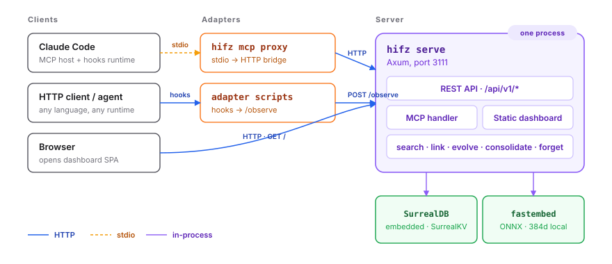
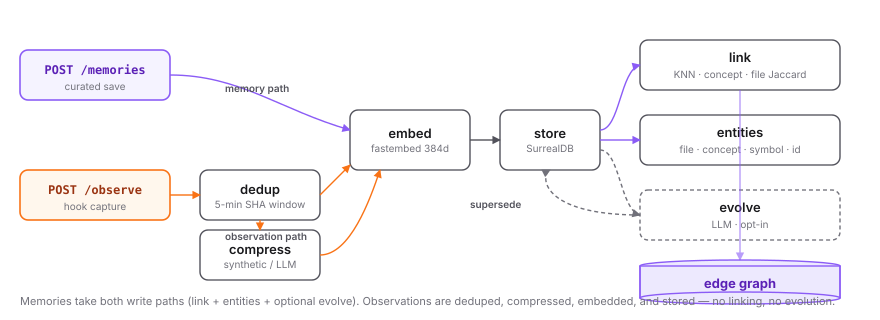
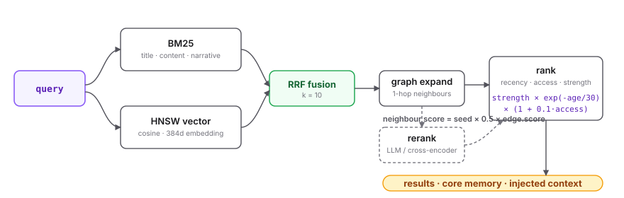
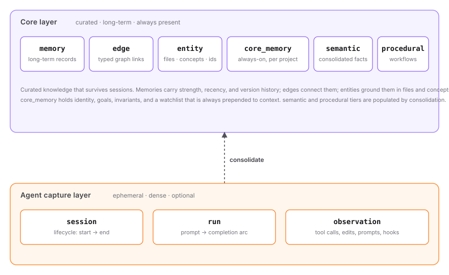
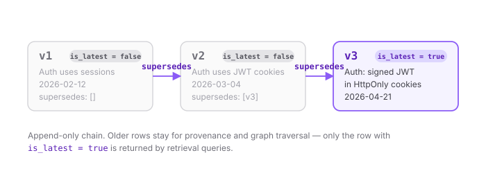

# hifz Architecture

Local-first persistent memory. A single Rust process (`hifz serve`) owns an embedded SurrealDB, a fastembed ONNX embedder, the search index, the REST API, and the static dashboard. Anything that speaks HTTP — applications, scripts, agents — can save and search memories. The Claude Code adapter is the reference integration: hooks capture what happens during a session, memories store what matters long-term, and a knowledge graph ties everything together.

## Topology

<p align="center"></p>

The MCP proxy (`hifz mcp`) is a thin stdio bridge that translates MCP tool calls into HTTP. Adapters (like `adapters/claude-code/`) speak the same HTTP API.

## Pipelines

### Write path

<p align="center"></p>

### Read path

<p align="center"></p>

Background processing — `consolidate` (4 tiers) and `forget` (GC + contradiction detection) — runs on demand via `POST /consolidate` and `POST /forget-gc`. See [Consolidation](#consolidation) below.

---

## Two-layer ontology

<p align="center"></p>

hifz separates **core knowledge** from **agent capture**:

**Core layer** — always present:

| Table | Purpose |
|-------|---------|
| `memory` | Curated, project-scoped long-term knowledge |
| `edge` | Typed graph edges between memory nodes |
| `entity` | Named things (files, symbols, concepts, errors) |
| `core_memory` | Per-project singleton (identity, goals, invariants, watchlist) |
| `semantic_memory` | Facts consolidated from sessions (tier 1 consolidation) |
| `procedural_memory` | Workflows consolidated from observations (tier 3 consolidation) |

**Agent capture layer** — optional, populated by adapter hooks:

| Table | Purpose |
|-------|---------|
| `session` | Claude Code session lifecycle |
| `run` | Task-scoped trajectory (prompt → completion) |
| `observation` | Dense, ephemeral hook records |

`observation` has a `metadata: option<object>` field for structured payloads and a `obs_type` string field. Notable `obs_type` values: `commit_made`, `plan_activated`, `session_summary`.

`memory` has a `pinned: bool DEFAULT false` field. Plans are stored as `memory WHERE category='plan' AND pinned=true AND tags=['active']`.

### Edge vocabulary

Knowledge edges: `similar_to`, `elaborates`, `contradicts`, `supports`, `depends_on`, `alternative_to`, `derived_from`

Provenance edges: `generated_by`, `informed`, `motivated`, `implemented_by`, `part_of`, `follows`

Deterministic link edges (write-time): `embedding`, `concept`, `file`, `entity`

LLM-proposed edges (opt-in): `semantic`

---

## Observation Pipeline

**Hook → observe → compress → store → run::append**

Claude Code fires shell hooks on events: `SessionStart`, `UserPromptSubmit`, `PostToolUse`, `Stop`, `TaskCompleted`, `SessionEnd`. Each hook POSTs a JSON payload to `/api/v1/observe`.

### observe.rs

Entry point for all incoming data. Handles run lifecycle before dedup so lifecycle events are never dropped:

- `prompt_submit` → creates a new run via `run::start`
- `Stop` / `TaskCompleted` → closes the open run via `run::close`

Then: dedup check (hash of session_id + tool_name + tool_input) → compression → embedding → store observation → append to open run.

Git commit detection is handled by the adapter (`adapters/claude-code/scripts/post-tool-use.mjs`). When a Bash tool output matches a commit pattern, the adapter POSTs an observation with `obs_type='commit_made'` and `metadata` containing `sha`, `branch`, `message`, and `files`.

### compress.rs

Reduces raw hook payloads into structured observations: title, narrative, facts, concepts, files, importance score. Two modes:

- **Synthetic** (default): regex/heuristic extraction, no LLM
- **LLM** (opt-in): Ollama summarization with synthetic fallback

### run.rs

A task-scoped trajectory: one user prompt through to completion. Spans `UserPromptSubmit → Stop/TaskCompleted`. Tracks which observations belong to which task, and can derive a lesson from its highest-importance observations.

---

## Memory System

### Embeddings

All embeddings use **fastembed AllMiniLM-L6-V2** (384 dimensions, runs locally via ONNX — no API calls). The text fed into the model differs by record type:

| Record | Embed input | Where |
|--------|------------|-------|
| Observation | `"{title} {narrative}"` | `observe.rs:109` |
| Memory | `"{title}\n{content}\nconcepts: a, b\nfiles: x, y"` | `remember.rs:build_embed_text` |

Observations embed a compressed summary of the tool call. Memories embed richer text including extracted concepts and file paths, so the vector captures both semantic meaning and structural context.

### remember.rs — Creation

`/api/v1/memories` creates a `memory` record with:
- `version = 1`, `is_latest = true`, `strength = 1.0`
- Embedding from title + content + concepts + files (see above)
- Immediate link generation via `link::generate_links`
- Entity extraction and entity-based linking

### link.rs — Deterministic Linking

When a memory is saved, `generate_links` compares it against every existing memory in the same project via three channels. If any channel exceeds its threshold, an `edge` record is created between the two memories. These edges are later used during retrieval: `search.rs` does 1-hop graph expansion from search hits, pulling in neighbors that didn't match the query directly but are graph-connected to something that did (neighbor score = seed score × 0.5 × edge score).

| Channel | What it compares | Threshold | Score stored on edge |
|---------|-----------------|-----------|---------------------|
| Embedding KNN | Cosine distance between 384-dim vectors via HNSW index. Distance < 0.25 means similarity > 0.75 — the memories are semantically close. | < 0.25 | `1.0 - distance` |
| Concept Jaccard | Overlap of `concepts[]` arrays. Jaccard = \|intersection\| / \|union\|. E.g. `["auth","JWT","session"]` vs `["auth","JWT","cookie"]` → 2/4 = 0.50 — linked. | ≥ 0.30 | Jaccard value |
| File Jaccard | Same set math on `files[]` arrays. Two memories touching overlapping files get linked. | ≥ 0.30 | Jaccard value |

Entity-based links (`via='entity'`) are added from `entities.rs`. Per-`via` deduplication keeps the highest score.

### entities.rs — Entity Extraction

Deterministic (no LLM) extraction of four entity types from observations and memories: files, concepts, functions, and identifiers. Entities are upserted into the `entity` table and feed into `edge` records.

### evolve.rs — LLM Evolution (opt-in)

Gated by `HIFZ_LLM_EVOLVE=true`. After a memory is saved, gathers up to 5 neighbors from the link graph and sends them to Ollama. The LLM can:

- Add keywords, tags, context to the new memory
- Update neighbor metadata
- Create new `via='semantic'` edges
- Mark older memories as **superseded** (`is_latest = false`)

Retrieval works fully without evolution — it's additive.

---

## Grounding

Commit grounding is handled by the adapter layer. When `post-tool-use.mjs` detects a git commit in Bash output, it records an observation with `obs_type='commit_made'` and metadata `{sha, branch, message, files}`. The server's `ground.rs` responds to these observations by strengthening memories that reference the committed files (`strength += 15%`, clamped to 1.0).

**Uncommitted decay**: When a session ends with file edits but no commit observation, memories referencing those uncommitted files get `forget_after = now + 60 days`. If the work was abandoned, the memory fades.

### forget.rs — Garbage Collection

Handles actual deletion of expired memories (`forget_after < now`). Also detects contradictions: memories with content Jaccard ≥ 0.9 are marked `is_latest = false` on the older version.

---

## Retrieval

### search.rs — Hybrid Search

Three-stage retrieval:
1. **BM25 full-text** on title, narrative, facts_text
2. **HNSW vector** on embedding
3. **RRF fusion** merges both result sets

Optional second stage: reranking via LLM (`llm_rerank.rs`) or cross-encoder (`rerank.rs`).

### rank.rs — Memory Scoring

Rust-side scoring formula (SurrealDB lacks `math::exp`):

```
score = strength × exp(-age_days / HALF_LIFE) × (1 + ACCESS_COEF × min(access, ACCESS_CAP))
```

Recency decays, access reinforces, grounding-derived strength anchors.

### core_mem.rs — Always-On Context

Per-project block: identity, goals, invariants, watchlist. Always prepended to injected context so these never drift out on compaction.

### plans.rs — Plans as Pinned Memory

Plans are stored as `memory` records with `category='plan'`, `pinned=true`, and `tags=['active']` while active. The lifecycle:

- `POST /api/v1/plans/activate` — promotes a memory to active, appends its title to `core_memory.goals` so the plan rides along on every context injection.
- `POST /api/v1/plans/{id}/complete` — clears the `active` tag and unpins; the memory remains searchable as historical context.
- `POST /api/v1/plans/{id}/abandon` — same as complete, but tagged `abandoned`.
- `GET /api/v1/plans/current` and `GET /api/v1/plans` — list active or all plans.

Treating plans as memories means they participate in linking, search, and graph traversal; activation is just a pin + a goal injection.

### run.rs — Run Search

Runs are persisted task-trajectories (see Observation Pipeline). After the fact they are queryable:

- `POST /api/v1/runs` — search by query/project/session, full-text over the lesson summary.
- `GET /api/v1/runs/{id}` — fetch a run with its observation chain.
- `GET /api/v1/runs/count` — counts for dashboard tiles.

The `hifz_runs` MCP tool wraps `/runs`.

---

## Consolidation

### consolidate.rs — Four Tiers

Triggered via `POST /api/v1/consolidate` (or the `hifz_consolidate` MCP tool). Tiers 1 and 3 require Ollama and are skipped if unavailable.

| Tier | Name | What it does | Requires LLM |
|------|------|-------------|:---:|
| 1 | Semantic | Merges session summaries into `semantic_memory` facts | Yes |
| 2 | Reflect | Clusters related memories by shared concepts | No |
| 3 | Procedural | Detects recurring action sequences from observations and extracts them as named workflows into `procedural_memory` (trigger condition + steps). | Yes |
| 4 | Decay | Exponential decay on `strength` for stale memories | No |

### Enabling LLM features

All LLM features are opt-in and require a local Ollama instance. Set in `~/.hifz/.env`:

```env
OLLAMA_URL=http://localhost:11434    # required for any LLM feature
HIFZ_AUTO_COMPRESS=true              # LLM-powered observation compression (richer titles/narratives)
HIFZ_LLM_EVOLVE=true                 # after saving a memory, LLM refines it using graph neighbors
```

Without these, hifz runs fully offline using synthetic compression, fastembed vectors, and deterministic linking. Consolidation tiers 1 and 3 are silently skipped if Ollama is not configured.

---

## Versioning

Memories have `version`, `parent_id`, `supersedes[]`, `is_latest`. When evolution or contradiction detection marks a memory as superseded:

- `is_latest` → `false` on the older memory
- Newer memory's ID appended to older's `supersedes[]`
- All retrieval queries filter `WHERE is_latest = true`

This creates an append-only version chain where only the canonical version of each memory is surfaced.

<p align="center"></p>

---

## Module Index

| Module | Purpose |
|--------|---------|
| `observe` | Hook payload ingestion, run lifecycle |
| `compress` | Reduce raw payloads to structured observations |
| `run` | Task-scoped trajectories (prompt → completion) |
| `remember` | Memory creation with embedding + linking |
| `link` | Write-time KNN/Jaccard/entity edge generation |
| `entities` | Deterministic entity extraction (no LLM) |
| `evolve` | Opt-in LLM neighbour refinement and supersession |
| `ground` | Commit strengthening + uncommitted decay |
| `forget` | TTL expiry and contradiction detection |
| `search` | Hybrid BM25 + HNSW retrieval with RRF fusion |
| `rank` | Recency/access/strength scoring formula |
| `core_mem` | Always-on per-project context |
| `consolidate` | 4-tier background processing pipeline |
| `rerank` | Cross-encoder reranking (fastembed/ONNX) |
| `llm_rerank` | LLM-as-reranker via Ollama |
| `context` | Context generation for session injection |
| `digest` | Project-level concept/file frequency summaries |
| `dedup` | Content-hash deduplication with TTL |
| `embed` | fastembed model initialization |
| `db` | SurrealDB schema and connection |
| `config` | Configuration from `~/.hifz/.env` |
| `models` | Shared data structures |
| `prompts` | System prompt constants for LLM features |
| `mcp` | MCP server (thin HTTP proxy to REST) |
| `web` | Axum REST API + static site serving |
| `plans` | Plans-as-memory lifecycle (activate / complete / abandon) |
| `commits` | Commit ingestion and diff serving |
| `event` | Generic event ingestion (`/events`, `/events/batch`) |
| `session` | Session lifecycle and tree assembly |
| `timeline` | Chronological observation queries |
| `trace` | Knowledge-graph traversal from a seed node |
| `reindex` | Rebuild BM25 / HNSW indexes |
| `export` | Bulk export of all memory data |
| `health` | Liveness and readiness endpoints |
| `ollama` | Ollama HTTP client wrapper |

---

## MCP Surface (17 tools)

The MCP proxy (`hifz mcp`) exposes a curated subset of the REST API as MCP tools, grouped by purpose. Each tool wraps one or more `/api/v1/*` endpoints.

| Group | Tool | Wraps |
|---|---|---|
| **Memory** | `hifz_save` | `POST /memories` |
| | `hifz_recall` | `POST /search` + graph expansion |
| | `hifz_search` | `POST /search` |
| | `hifz_delete` | `DELETE /memories/{id}` |
| | `hifz_evolve` | `POST /memories/{id}/evolve` |
| **Core** | `hifz_core_get` | `GET /core/{project}` |
| | `hifz_core_edit` | `PATCH /core/{project}` |
| **Plans** | `hifz_current_plan` | `GET /plans/current` |
| | `hifz_plans` | `GET /plans` |
| | `hifz_activate_plan` | `POST /plans/activate` |
| **Trajectories** | `hifz_sessions` | `GET /sessions` |
| | `hifz_runs` | `POST /runs` |
| | `hifz_timeline` | `GET /timeline` |
| | `hifz_digest` | `GET /digest` |
| | `hifz_export` | `GET /export` |
| **Graph** | `hifz_trace` | `POST /trace` |
| **Provenance** | `hifz_commits` | `GET /commits` |
| **Code** | `hifz_code_index` | `POST /code/index` |
| | `hifz_code_search` | `POST /code/search` |
| | `hifz_link_code` | `POST /code/link` |
| | `hifz_link_symbol` | `POST /code/link/symbol` |
| | `hifz_code_gc` | `POST /code/gc` |

The proxy is intentionally thin: schema validation, JSON ↔ MCP conversion, and HTTP forwarding only. All real logic stays in the server, so REST clients and MCP clients see the same behavior.

---

## Code dimension

Memory is one half of the story. The other is **code itself, indexed and addressable**, so a memory can reference a precise location and the location is a first-class searchable row.

`src/code/` is a native-Rust port of [cocoindex-code](https://github.com/cocoindex-io/cocoindex-code)'s chunk + index pipeline. It is compiled into every hifz build (tree-sitter grammars included) — there is no opt-out feature flag.

### Tables

| Table | Purpose |
|-------|---------|
| `code_file` | One row per indexed file. `(project, path)` UNIQUE; carries `mtime_ns` + `content_hash` for idempotent re-indexing and a 30-day `deleted_at` tombstone for audit |
| `code_chunk` | One row per chunk. Vector + BM25 indexed (separate `code_analyzer` — no Snowball, identifiers like `getUserId` survive). Each chunk also lists its defined `symbols[]` |
| `code_symbol` | One row per named function/struct/enum/trait/method/etc, extracted via tree-sitter Query. Embedded for symbol-level search; tied to its `primary_chunk` |

### New edges

| Edge | Domain | Purpose |
|------|--------|---------|
| `references` | Memory → CodeChunk \| CodeFile | Memory points at a precise line range |
| `references_symbol` | Memory → CodeSymbol | Memory points at a named symbol (survives chunk re-splitting) |
| `part_of` *(extended)* | CodeChunk → CodeFile, CodeSymbol → CodeFile | Structural containment |

### Pipeline

```
hifz_code_index(project, root)
  → walker (gitignore-honest, 2 MiB cap, NUL-byte binary heuristic)
  → for each path: stat (mtime, sha256) → skip if unchanged
       → splitter (text-splitter::CodeSplitter for known langs;
                   fallback to chunk::split for the rest)
       → tree-sitter Query → symbol manifest
       → embedder.embed_batch (existing fastembed AllMiniLM, 384 dims)
       → snapshot inbound `references` edges (re-anchor metadata)
       → DELETE old chunks/symbols → CREATE new ones
       → re-anchor archived edges to whichever new chunk overlaps
         the original (ref_path, ref_start, ref_end)
```

### Re-anchoring across edits

Edge `metadata` records the original `(ref_path, ref_start, ref_end, anchor_version)`. When a file is re-indexed, `re_anchor_references` re-resolves that line range against the new chunks and rewrites the edge's `out` endpoint. If the lines vanished entirely, the edge is dropped with `dropped_reason='lines_deleted'`. Symbol edges get the same treatment keyed on `matched_symbol`. This is the load-bearing piece that makes "memory points at a precise point in code" durable across edits.

### Auto-extraction (conservative)

`enrich::save_enriched` calls `code::link::auto_link_memory` after `apply_llm_links`. Three regexes:

- `FILE_LINE_RE` — `path/to/file.ext:NN[-MM]` → chunk-level edges
- `FILE_PERMALINK_RE` — GitHub `…/blob/<sha>/…#L42-L58` → chunk-level
- `QUALIFIED_SYMBOL_RE` — `module::name` or `Type::method` → symbol-level

By design (G9 in the implementation plan), bareword identifiers DO NOT auto-link. False-positive symbol links would degrade graph quality faster than missed links degrade recall.

### GC + decay

`hifz_code_gc { project, root }` runs two passes:

1. **Reconcile deletions** — diff disk state against `code_file` rows. Files missing from disk get inbound code edges dropped (with audit metadata), chunks/symbols deleted, and a 30-day tombstone set. Tombstones are swept by `forget::run_forget`.
2. **Cold decay** *(opt-in `force_decay=true`)* — chunks with no inbound refs AND `last_committed_at < now - 60d` AND `created_at < now - 30d` lose 5 % strength per pass. Strength < 0.1 → delete.

`ground::on_commit_observation` extension bumps `code_chunk.strength` by 10 % and updates `last_committed_at` for chunks whose path matches a committed file.

### Optional file watcher

`HIFZ_CODE_WATCH=1 HIFZ_CODE_WATCH_ROOTS=hifz=/path/to/hifz,docs=/path/to/docs` starts a debounced (500 ms) `notify` watcher per pair, coalescing bursts to one re-index per file.

---

## Dashboard

A SvelteKit single-page app lives in `website/` and is served as static assets by the `web` module under `http://localhost:3111`. It is read-mostly: it consumes the same REST API and never bypasses it.

| Route | Reads |
|---|---|
| `/` | `/health`, `/digest`, `/sessions`, `/commits` |
| `/memories` | `/memories` (GET search) |
| `/observations` | `/observations` |
| `/sessions`, `/sessions/[id]` | `/sessions`, `/sessions/{id}/tree` |
| `/runs`, `/runs/[id]` | `/runs`, `/runs/{id}` |
| `/commits`, `/commits/[sha]` | `/commits`, `/commits/{sha}/diff` |
| `/graph` | `/trace`, `/memories/{id}/links` |
