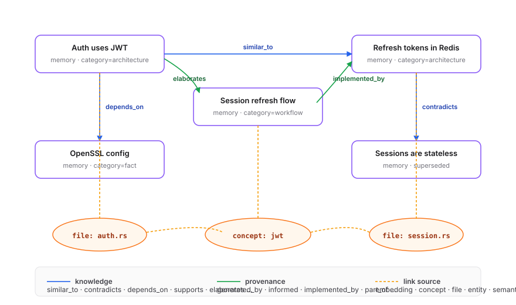

<div align="center">

# hifz

### A persistent memory engine.
### Hybrid search, knowledge graph, lifecycle-aware. Local-first, written in Rust.

[](LICENSE)
[](https://www.rust-lang.org/)
[](https://surrealdb.com/)
[](#)
[](#)

</div>

---

hifz **stores, links, ranks, and forgets** memories. One Axum process owns an embedded SurrealDB, a fastembed ONNX embedder, the search index, the REST API, an MCP proxy, and a dashboard. Anything that speaks HTTP is a valid client. Nothing leaves your machine.

The product is opinionated: a curated long-term layer separated from ephemeral capture, a typed knowledge graph linking everything, recency- and grounding-aware ranking, and lifecycle rules that mark stale memories as superseded instead of just deleting them.

---

## The mental model — two-layer ontology

<p align="center"></p>

Capture is dense and short-lived. Core is curated and persistent. Consolidation lifts patterns from one into the other.

---

## How hifz remembers — the write path

<p align="center"></p>

Every saved memory is embedded, stored, then linked against existing memories through three independent channels. Any channel that exceeds its threshold creates an `edge`:

| Channel | Compares | Threshold | Edge score |
|---|---|---|---|
| **Embedding KNN** | Cosine distance between 384-d vectors via HNSW | distance < 0.25 | `1 - distance` |
| **Concept Jaccard** | Overlap of `concepts[]` arrays | ≥ 0.30 | Jaccard value |
| **File Jaccard** | Overlap of `files[]` arrays | ≥ 0.30 | Jaccard value |

Entity extraction (files, concepts, functions, identifiers) is deterministic — no LLM. Evolution is opt-in: when enabled, an LLM reads up to five graph neighbors and may add tags, propose `semantic` edges, or mark older memories superseded.

---

## How hifz recalls — the read path

<p align="center"></p>

After fusion, hifz pulls 1-hop neighbors from the link graph (neighbor score = seed × 0.5 × edge weight) so memories that don't match the query directly but are graph-connected to a hit can still surface. Final ordering is a Rust-side score:

```
score = strength × exp(-age_days / HALF_LIFE) × (1 + ACCESS_COEF × min(access, ACCESS_CAP))
```

Recency decays. Access reinforces. Grounding-derived strength anchors.

---

## The knowledge graph

Edges are typed and segmented by source so retrieval can weight them differently:

| Vocabulary | Edge types |
|---|---|
| **Knowledge** | `similar_to`, `elaborates`, `contradicts`, `supports`, `depends_on`, `alternative_to`, `derived_from` |
| **Provenance** | `generated_by`, `informed`, `motivated`, `implemented_by`, `part_of`, `follows` |
| **Link source** | `embedding`, `concept`, `file`, `entity` (deterministic), `semantic` (LLM-proposed) |

<p align="center"></p>

Traverse from any seed with `POST /trace` (or `hifz_trace`): forward, backward, or both, with RRF over multi-hop expansions.

---

## Forgetting and evolution

| Mechanism | What it does |
|---|---|
| **TTL GC** | `forget_after` timestamps expire memories. `POST /forget-gc` runs the sweep. |
| **Contradiction detection** | Two memories with content Jaccard ≥ 0.9 → older is marked `is_latest = false`. |
| **Grounding** | When the adapter posts a `commit_made` observation, memories referencing the committed files get `strength += 15%` (clamped to 1.0). |
| **Uncommitted decay** | A session that edits files but never commits sets `forget_after = now + 60 days` on the related memories. Abandoned work fades. |
| **Evolution** | Opt-in: after a save, an LLM examines up to five neighbors and can refine, link, or supersede. Retrieval works fully without it. |

---

## Memory tiers

Three persistent tiers above raw `memory`:

| Tier | Shape | Origin |
|---|---|---|
| **`core_memory`** | One per project. Identity, goals, invariants, watchlist. Always prepended to injected context — never drifts on compaction. | Edited directly via `PATCH /core/{project}` or `hifz_core_edit`. |
| **`semantic_memory`** | Consolidated facts. | Tier 1 consolidation merges session summaries (LLM). |
| **`procedural_memory`** | Named workflows: trigger condition + steps. | Tier 3 consolidation extracts recurring action sequences (LLM). |

Consolidation is on-demand via `POST /consolidate`:

| Tier | Name | What it does | LLM |
|---|---|---|:---:|
| 1 | Semantic | Merges session summaries into `semantic_memory` facts | Yes |
| 2 | Reflect | Clusters related memories by shared concepts | No |
| 3 | Procedural | Extracts recurring action sequences as workflows | Yes |
| 4 | Decay | Exponential decay on `strength` for stale memories | No |

LLM tiers (1 and 3) are silently skipped if Ollama is not configured.

---

## Versioning

Memories are append-only. When something supersedes an older version, the older row stays — `is_latest` flips to `false`, and the newer row's ID is appended to the older's `supersedes[]`.

<p align="center"></p>

Every retrieval query filters `WHERE is_latest = true`. The chain is preserved for provenance, traversal, and audit.

---

## Plans

Plans are first-class but not a separate table — they're memories with `category='plan'`, `pinned=true`, and `tags=['active']` while in flight. Activation is two side-effects:

1. The plan stays pinned (never decays, always searchable).
2. Its title is appended to `core_memory.goals` so it rides along on every context injection.

Completion clears the active tag and unpins. Plans participate in linking, search, and graph traversal like any other memory.

---

## Surfaces

| Surface | Shape | Use it from |
|---|---|---|
| **REST** | 29 endpoints across `/api/v1/*`, split into core memory and an optional agent-pipeline group | Any HTTP client — apps, scripts, agents in any language |
| **MCP** | 17 tools in 6 groups (Memory, Core, Plans, Trajectories, Graph, Provenance), thin wrapper over REST | Any MCP-speaking agent |
| **Dashboard** | SvelteKit SPA served by the same Axum process | Browser at `http://localhost:3111` |

<details>
<summary><b>MCP tools (17)</b></summary>

| Group | Tool | Purpose |
|---|---|---|
| Memory | `hifz_save` | Create a memory (category, tags, pinned) |
| | `hifz_recall` | Search observations + memories with graph expansion |
| | `hifz_search` | Hybrid BM25 + vector with RRF fusion |
| | `hifz_delete` | Delete a memory by ID |
| | `hifz_evolve` | LLM refinement of a memory (opt-in) |
| Core | `hifz_core_get` | Read project core memory |
| | `hifz_core_edit` | Edit core memory (set / add / remove) |
| Plans | `hifz_current_plan` | Active plan for a project |
| | `hifz_plans` | List plans by status |
| | `hifz_activate_plan` | Activate a plan, inject into core context |
| Trajectories | `hifz_sessions` | Recent sessions |
| | `hifz_runs` | Search task-scoped runs |
| | `hifz_timeline` | Chronological observations |
| | `hifz_digest` | Project intelligence (top concepts, files, stats) |
| | `hifz_export` | Export all memory data |
| Graph | `hifz_trace` | Walk the knowledge graph from a node |
| Provenance | `hifz_commits` | List commits |

</details>

<details>
<summary><b>REST endpoints (29)</b></summary>

**Core memory API**

| Method | Path |
|---|---|
| GET | `/health`, `/livez`, `/memories`, `/memories/{id}/links`, `/core/{project}`, `/export` |
| POST | `/memories`, `/search`, `/search/agentic`, `/context`, `/trace`, `/consolidate`, `/forget-gc`, `/seed/sample`, `/memories/{id}/evolve` |
| PATCH | `/core/{project}` |
| DELETE | `/memories/{id}` |

**Agent pipeline API**

| Method | Path |
|---|---|
| GET | `/sessions`, `/sessions/{id}`, `/sessions/{id}/tree`, `/events`, `/events/{id}`, `/observations`, `/timeline`, `/runs/count`, `/runs/{id}`, `/commits`, `/commits/{sha}/diff`, `/plans`, `/plans/current`, `/digest` |
| POST | `/sessions`, `/sessions/end`, `/observe`, `/events`, `/events/batch`, `/runs`, `/plans/activate`, `/plans/{id}/complete`, `/plans/{id}/abandon` |

</details>

---

## Storage and local-first

| Mode | Command | Persistence |
|---|---|---|
| In-memory | `hifz serve --memory` | Lost on restart |
| SurrealKV | `hifz serve --db-path ~/.hifz/data` | On disk |

Embeddings use **fastembed AllMiniLM-L6-V2** (384-dim, ONNX, runs locally — no network). LLM features are opt-in via Ollama. Without LLM, hifz uses synthetic compression, deterministic linking, and skips LLM consolidation tiers.

Optional `~/.hifz/.env`:

```env
OLLAMA_URL=http://localhost:11434
OLLAMA_MODEL=qwen2.5:7b
HIFZ_AUTO_COMPRESS=true     # richer observation summaries
HIFZ_LLM_EVOLVE=true        # post-save LLM refinement
TOKEN_BUDGET=2000
```

---

## Quickstart

```bash
git clone https://github.com/arriqaaq/hifz.git
cd hifz
cargo build --release
./target/release/hifz serve --db-path ~/.hifz/data
```

Save and search:

```bash
curl -X POST http://localhost:3111/api/v1/memories \
  -H 'content-type: application/json' \
  -d '{"project":"demo","title":"Auth uses JWT","content":"Sessions are signed JWTs in HttpOnly cookies."}'

curl -X POST http://localhost:3111/api/v1/search \
  -H 'content-type: application/json' \
  -d '{"project":"demo","query":"authentication"}'
```

Open [http://localhost:3111](http://localhost:3111) for the dashboard.

---

## Dashboard

A SvelteKit SPA lives in `website/` and is served by the same Axum process. It is a read-mostly client of the REST API.

| Route | Shows |
|---|---|
| `/` | Health, digest, recent sessions, recent commits |
| `/memories` | Search, filter, delete |
| `/observations` | Captured timeline |
| `/sessions`, `/sessions/[id]` | Sessions list and detail tree |
| `/runs`, `/runs/[id]` | Task-scoped trajectories |
| `/commits`, `/commits/[sha]` | Git log with diff viewer |
| `/graph` | Knowledge graph visualization |

<!-- screenshot: docs/img/dashboard.png -->

---

## Integrations

### HTTP — any language

Anything that can `POST /api/v1/memories` and `POST /api/v1/search` is a first-class client. See the surface tables above and [ARCHITECTURE.md](ARCHITECTURE.md) for details.

### Build your own adapter

Two patterns:
- **Memory client** — call `/memories`, `/search`, `/trace`, `/core/{project}` to make hifz a knowledge backend for an app, IDE, CLI, or another agent.
- **Capture client** — additionally `POST /observe` (or `/events`, `/events/batch`) on lifecycle events to populate the agent capture layer. The Claude Code adapter does this.

### Claude Code (reference adapter)

`.mcp.json` at the project root:

```json
{
  "mcpServers": {
    "hifz": {
      "command": "/absolute/path/to/hifz",
      "args": ["mcp"]
    }
  }
}
```

Install hooks and slash commands:

```
/plugin marketplace add /path/to/hifz/adapters/claude-code
/plugin install hifz@hifz
```

Optional auto-injection at session start, in `.claude/settings.local.json`:

```json
{ "env": { "HIFZ_INJECT_CONTEXT": "true" } }
```

The adapter ships four slash commands — `/recall`, `/remember`, `/forget`, `/session-history` — and lifecycle hooks that auto-capture tool use, prompts, and session/run boundaries to `/observe`.

---

## Benchmarks

```bash
./benchmark/download_dataset.sh
cargo run --bin longmemeval-bench -- bm25
cargo run --bin longmemeval-bench -- hybrid
cargo run --release --bin memory-bench -- full
cargo run --release --bin memory-bench -- base
```

---

<details>
<summary><b>Troubleshooting</b></summary>

**Server not responding.** `curl http://localhost:3111/api/v1/health`. If it fails, the server isn't running — start it with `./target/release/hifz serve --db-path ~/.hifz/data`.

**MCP not in Claude Code's `/mcp`.** Restart Claude Code so it picks up `.mcp.json`.

**Adapter not auto-capturing.** Check `grep -A2 enabledPlugins ~/.claude/settings.json` — should include `"hifz@hifz": true`. Reinstall via `/plugin install hifz@hifz` if missing.

**Context not injected.** Ensure `HIFZ_INJECT_CONTEXT=true` in `.claude/settings.local.json`.

**Test the MCP binary:**
```bash
echo '{"jsonrpc":"2.0","id":1,"method":"initialize","params":{}}' | /path/to/hifz mcp
```

**Test a hook:**
```bash
echo '{"session_id":"test","cwd":"/tmp","tool_name":"Read","tool_input":{"file_path":"src/main.rs"}}' \
  | node adapters/claude-code/scripts/post-tool-use.mjs
```

</details>

---

## Docs

- [ARCHITECTURE.md](ARCHITECTURE.md) — full architecture, ontology, write/read pipelines, consolidation, module index.
- [docs/architecture/memory.md](docs/architecture/memory.md) — memory model deep dive.
- [docs/research/memory-architecture.md](docs/research/memory-architecture.md) — prior art (A-MEM, Mem0, MemGPT, MIRIX) and design tradeoffs.

## License

Apache License 2.0
