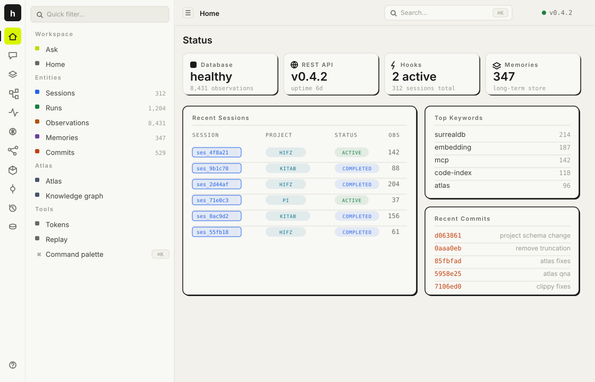
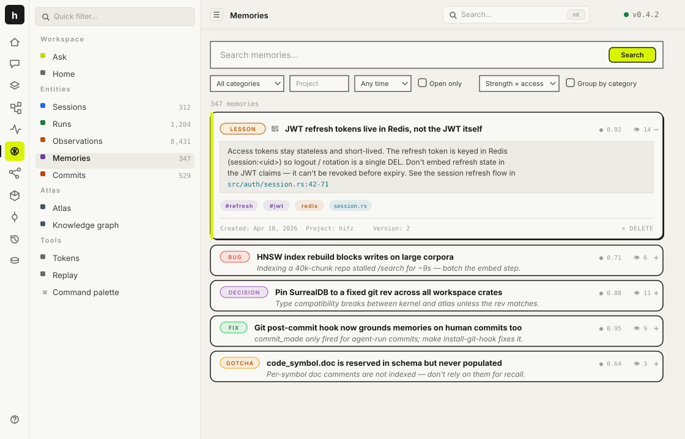
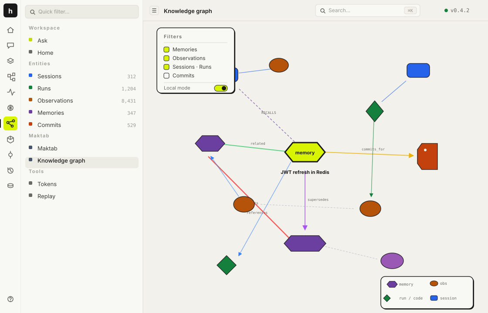
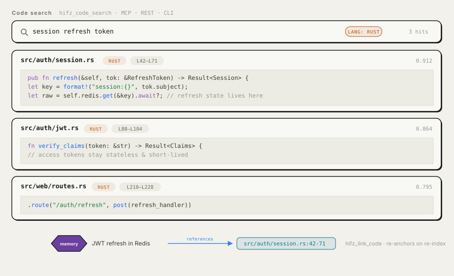
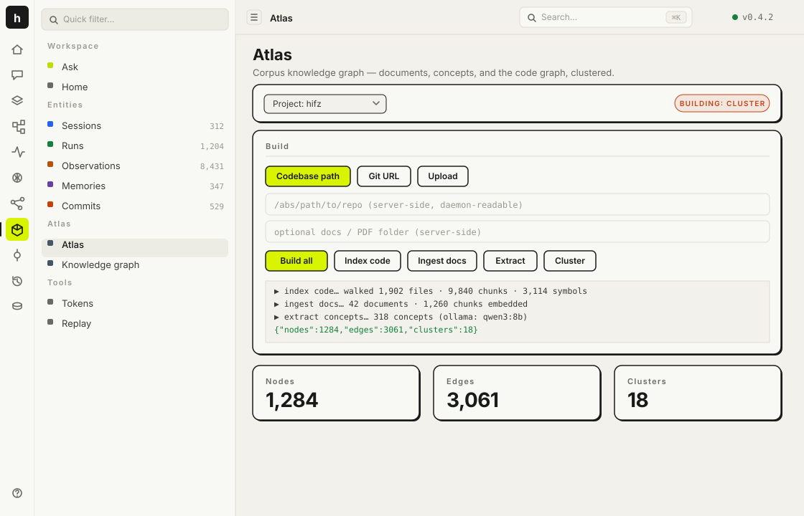
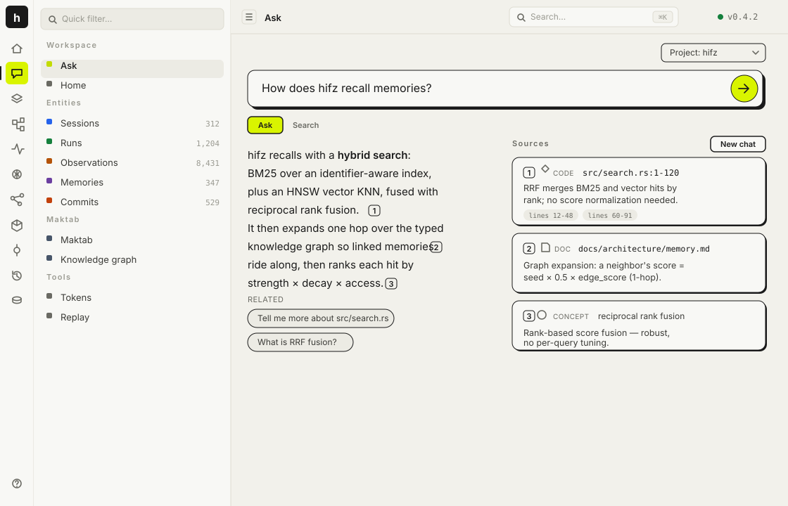

<div align="center">

# hifz

### Persistent memory for coding agents — local-first, written in Rust.

Hybrid search · typed knowledge graph · code intelligence · corpus Q&A · lifecycle-aware forgetting.

[](LICENSE)
[](https://www.rust-lang.org/)
[](https://surrealdb.com/)
[](#)
[](#)

</div>

<p align="center"></p>

---

## What is hifz

hifz gives a coding agent a memory that persists across sessions. One Axum process owns an embedded SurrealDB, a local ONNX embedder, a hybrid search index, a typed knowledge graph, code intelligence, the REST API, an MCP server, and a dashboard. Anything that speaks HTTP is a client. **Nothing leaves your machine** — embeddings run locally and LLM features are opt-in via Ollama.

It captures your work as observations, sessions, and runs; distills the durable parts into curated memories; recalls them with hybrid search and 1-hop graph expansion; grounds them in your git history; and links them straight to the lines of code they describe.

| | |
|---|---|
| 🧠 **Memory** | Save lessons, decisions, bugs, fixes, plans. Recall by meaning, recency, and grounding. |
| 🕸 **Knowledge graph** | Every memory, observation, session, run, and commit is a typed node with typed edges. |
| 🔍 **Code search** | Tree-sitter indexing for 8 languages, hybrid BM25 + vector search, memory↔code links. |
| 🗺 **Atlas** | Ingest a repo + docs into a clustered corpus graph and ask it questions, with citations. |
| ⏳ **Lifecycle** | Recency decay, commit-grounding, contradiction detection, append-only versioning. |

---

## Memory

Save a lesson, decision, bug, fix, plan, or design once — recall it in any future session. The browser lets you search, filter by category, sort by strength × access, and expand any memory to its full content, tags, and the files it touches.

<p align="center"></p>

```bash
# save (CLI — POSTs straight to the server, no agent needed)
hifz save --content "JWT refresh tokens live in Redis, not the JWT claims" \
  --title "Auth refresh design" --category lesson --project hifz --file src/auth/session.rs

# recall (MCP) — hybrid search + 1-hop graph expansion
hifz_recall { "project": "hifz", "query": "how does refresh work?" }
```

Each memory carries a `strength`, an access count, and a `last_committed_at` watermark. Retrieval ranks by a blend of relevance, recency decay, reinforcement, and grounding — so what you actually shipped surfaces first and abandoned notes fade.

---

## Agentic memory & the knowledge graph

hifz doesn't store memories as a flat list. Observations (captured tool use), sessions, runs, commits, and curated memories are all **typed nodes** joined by **typed edges** — provenance, conceptual, argumentative, lifecycle, and code-domain. The graph view renders the whole substrate: shapes encode node kind (hexagon = memory, diamond = run, ellipse = observation, rounded rect = session, tag = commit), colors encode type, and edge color/style encodes the relation.

<p align="center"></p>

Recall pulls 1-hop neighbors from this graph, so a memory that doesn't match your query directly but is linked to a hit can still surface. Edges are created deterministically on write (embedding KNN, shared concepts, shared files) and optionally enriched by an LLM. Full vocabulary and type-pair rules: [`docs/ontology.md`](docs/ontology.md).

---

## Code search & indexing

hifz indexes your repository with tree-sitter (Rust, Python, JavaScript/TypeScript, Go, Java, C, C++), chunks it language-aware, embeds every chunk, and extracts a symbol manifest. Search is hybrid — an identifier-aware BM25 index fused with vector KNN — and memories can be linked to a precise file + line range or to a named symbol.

<p align="center"></p>

```bash
# index a repo, then search it
hifz_code_index  { "project": "hifz", "root": "/path/to/repo" }
hifz_code_search { "project": "hifz", "query": "session refresh token", "language": "rust" }
```

Memory→code edges record the original `(path, start, end)` and **re-anchor on re-index**: when a file is re-split, the edge follows the lines it pointed at, or is dropped if those lines were deleted. Symbol links survive chunk re-splitting entirely. Indexing is idempotent (mtime + content hash), honors `.gitignore`, and reconciles deletions. Operator's guide: [`docs/code-indexing.md`](docs/code-indexing.md).

---

## Atlas — corpus knowledge graph & cited Q&A

Atlas rides the same substrate to turn a codebase plus its docs into a clustered, queryable corpus graph. Point it at a repo path, a git URL, or upload files; then **build** runs a pipeline — ingest docs → project the code graph → extract concepts → cluster → insights.

<p align="center"></p>

Ask the corpus a question and get an answer grounded in **citations** — every claim links back to a source document, code symbol, or concept, with the openable URI and the matching passages.

<p align="center"></p>

```bash
atlas code   /path/to/repo      # project the code graph
atlas ingest /path/to/docs      # PDFs, markdown, txt
atlas extract                   # concept extraction (LLM)
atlas cluster                   # modularity clustering
atlas query  "how does recall rank results?"
```

Atlas is feature-gated — build with `--features atlas` to mount its routes under `/api/v1/atlas`.

---

## Plans, sessions, replay & commit-grounding

- **Plans** are first-class memories (`category='plan'`). Activating one pins it and injects its title into the project's core context, so it rides along on every recall. Completing it clears the active tag but keeps it searchable as history.
- **Sessions & runs** capture the trajectory of work — observations grouped into task-scoped runs — without you doing anything; the Claude Code adapter posts them via hooks.
- **Replay** reconstructs the causal chain of a session as a transcript.
- **Commit-grounding** is the spine: when a commit lands, memories and code touching the committed files are strengthened and exempted from decay. Work that shipped persists; work that was abandoned fades. See [`plan-commit-grounding.md`](plan-commit-grounding.md).

---

## Quickstart

```bash
git clone https://github.com/arriqaaq/hifz.git
cd hifz
cargo build --release
./target/release/hifz serve --db-path ~/.hifz/data
```

Save and search over HTTP:

```bash
curl -X POST http://localhost:3111/api/v1/memories \
  -H 'content-type: application/json' \
  -d '{"project":"demo","title":"Auth uses JWT","content":"Sessions are signed JWTs in HttpOnly cookies."}'

curl -X POST http://localhost:3111/api/v1/search \
  -H 'content-type: application/json' \
  -d '{"project":"demo","query":"authentication"}'
```

Open [http://localhost:3111](http://localhost:3111) for the dashboard.

---

## Claude Code integration

The plugin is a **client** of a running hifz server, so order matters:

**1. Build the binary** — `cargo build --release` (→ `target/release/hifz`).

**2. Register the MCP server** in `.mcp.json` at the project root. The `command` path must point at the binary you built (`debug` vs `release` must match):

```json
{
  "mcpServers": {
    "hifz": { "command": "/absolute/path/to/target/release/hifz", "args": ["mcp"] }
  }
}
```

**3. Start the server.** On macOS, install it as an always-on service so the plugin never silently drops observations:

```bash
make install-service     # cargo build --release + load launchd agent
# ad-hoc alternative:
./target/release/hifz serve --db-path ~/.hifz/data
```

**4. Install the plugin** (hooks + skills):

```bash
claude plugin marketplace add /path/to/hifz/adapters/claude-code
claude plugin install hifz@hifz
claude plugin list                       # verify: hifz@hifz → enabled
```

**5. Restart Claude Code.** Hooks, skills, and the MCP server load at startup. After restart, `/mcp` lists `hifz`.

The adapter ships four skills — `/recall`, `/remember`, `/forget`, `/session-history` — plus lifecycle hooks that auto-capture tool use, prompts, and session/run boundaries. Optional auto-inject memory at session start, in `.claude/settings.local.json`:

```json
{ "env": { "HIFZ_INJECT_CONTEXT": "true" } }
```

For non–Claude Code clients: anything that can `POST /api/v1/memories` and `POST /api/v1/search` is a first-class memory client; add `POST /api/v1/agent/observe` to populate the capture layer. See [AGENTS.md](AGENTS.md).

---

## Run hifz as a background service (macOS)

```bash
make install-service     # cargo build --release, then load com.hifz.server
make service-status      # state/pid + /api/v1/livez check
make restart-service     # cargo build --release, then roll the new binary
make uninstall-service   # remove the agent (keeps ~/.hifz/data and logs)
```

Logs: `~/.hifz/logs/server.{out,err}.log`. DB: `~/.hifz/data`, port `3111`.

- **After changing hifz code, run `make restart-service`** — the daemon runs a fixed `target/release/hifz` and won't pick up a rebuild until restarted.
- `make dev` is foreground/testing only and **conflicts with the service on port 3111**. Stop the service first, or run `HIFZ_PORT=3120 make dev`.
- `make stop` only pauses the daemon — KeepAlive resurrects it in ~10s. Use `make uninstall-service` to truly stop it.

---

## Surfaces

| Surface | Shape | Use it from |
|---|---|---|
| **REST** | `/api/v1/*` — core memory, agent pipeline, code intelligence, and (optional) Atlas groups | Any HTTP client, any language |
| **MCP** | Tools across Memory, Code, Core, Plans, Trajectories, Graph, and (optional) Atlas groups | Any MCP-speaking agent |
| **Dashboard** | SvelteKit SPA served by the same Axum process | Browser at `http://localhost:3111` |

<details>
<summary><b>MCP tools</b></summary>

| Group | Tool | Purpose |
|---|---|---|
| Memory | `hifz_save` | Create a memory (category, tags, files, pinned) |
| | `hifz_recall` | Search memories + observations with graph expansion |
| | `hifz_search` | Hybrid BM25 + vector with RRF fusion |
| | `hifz_delete` | Delete a memory by ID |
| | `hifz_evolve` | LLM refinement of a memory (opt-in) |
| Code | `hifz_code_index` | Index a repository (tree-sitter, 8 languages) |
| | `hifz_code_search` | Hybrid code search, optional language/path filters |
| | `hifz_link_code` | Link a memory to a file + line range |
| | `hifz_link_symbol` | Link a memory to a named symbol |
| Core | `hifz_core_get` / `hifz_core_edit` | Read / edit project core memory |
| Plans | `hifz_current_plan` / `hifz_plans` / `hifz_activate_plan` / `hifz_complete_plan` | Plan lifecycle |
| Trajectories | `hifz_sessions` / `hifz_runs` / `hifz_timeline` / `hifz_digest` / `hifz_export` | Sessions, runs, timeline, project intel, export |
| Graph | `hifz_trace` | Walk the knowledge graph from a node |
| Atlas *(feature-gated)* | `atlas_ingest` / `atlas_code` / `atlas_extract` / `atlas_cluster` / `atlas_insights` / `atlas_query` | Build and query the corpus graph |

</details>

<details>
<summary><b>Dashboard routes</b></summary>

| Route | Shows |
|---|---|
| `/` | Health, digest, recent sessions, recent commits |
| `/ask` | Corpus Q&A and search, with citations |
| `/memories` | Search, filter, expand, delete |
| `/graph` | Interactive knowledge graph |
| `/atlas` | Build & inspect the corpus graph |
| `/sessions`, `/runs`, `/observations` | Captured trajectory |
| `/commits` | Git log with diff viewer |
| `/replay` | Causal session replay |
| `/tokens` | Per-project token usage |

</details>

---

## Architecture

A curated long-term layer sits above a dense, short-lived capture layer; consolidation lifts patterns from one into the other.

<p align="center"></p>

**Write path.** Every saved memory is embedded, stored, then linked against existing memories through three independent channels. Any channel over its threshold creates an `edge`:

<p align="center"></p>

| Channel | Compares | Threshold | Edge score |
|---|---|---|---|
| **Embedding KNN** | Cosine distance between 384-d vectors via HNSW | distance < 0.25 | `1 - distance` |
| **Concept Jaccard** | Overlap of `concepts[]` arrays | ≥ 0.30 | Jaccard value |
| **File Jaccard** | Overlap of `files[]` arrays | ≥ 0.30 | Jaccard value |

Entity extraction (files, concepts, functions, identifiers) is deterministic. Evolution is opt-in: when enabled, an LLM reads up to five graph neighbors and may add tags, propose conceptual edges, or mark older memories superseded.

**Read path.** Hybrid retrieval (BM25 + HNSW) fused with reciprocal rank fusion, expanded one hop over the graph (neighbor score = seed × 0.5 × edge weight), then ordered by a Rust-side score:

<p align="center"></p>

```
score = strength × exp(-age_days / HALF_LIFE) × (1 + ACCESS_COEF × min(access, ACCESS_CAP))
```

**Typed knowledge graph.** Edges are typed and segmented by source so retrieval can weight them differently:

| Group | Edge types |
|---|---|
| **Co-occurrence** | `co_occurs_files`, `co_occurs_keywords`, `co_occurs_embedding`, `mentions` |
| **Provenance** | `generated_by`, `informed_by`, `derived_from`, `attributed_to`, `part_of`, `follows` |
| **Conceptual** | `broader`, `narrower`, `related`, `same_as` |
| **Argumentative** | `supports`, `contradicts`, `elaborates`, `responds_to` |
| **Lifecycle** | `supersedes`, `closes` |
| **Code-domain** | `touches_file`, `commits_for`, `tests`, `references`, `references_symbol` |

Every edge carries a `reason` field. Traverse from any seed with `POST /trace` (or `hifz_trace`).

<p align="center"></p>

**Versioning.** Memories are append-only. When something supersedes an older version, the older row stays — `is_latest` flips to `false` and the new ID is appended to `supersedes[]`. Every retrieval filters `WHERE is_latest = true`; the chain is kept for provenance and audit.

<p align="center"></p>

Full architecture, module index, and the observation pipeline: [ARCHITECTURE.md](ARCHITECTURE.md).

---

## Modes

hifz operates in one of two modes per insert. Both are valid; the difference is what the runtime can derive without an external service.

| | Deterministic (default) | LLM-augmented |
|---|---|---|
| **Trigger** | No Ollama, or `HIFZ_LLM_EVOLVE=false` | Ollama reachable AND `HIFZ_LLM_EVOLVE=true` |
| **Edges** | Co-occurrence, provenance, code-domain | The above PLUS conceptual + argumentative edges |
| **`context_summary` / `tags`** | Null / default | LLM-generated |
| **Cost** | One embedding call per insert | One embedding + one Ollama call per insert |

Same code path runs both ways. A row written in one mode reads fine in the other.

---

## Forgetting & evolution

| Mechanism | What it does |
|---|---|
| **TTL GC** | `forget_after` timestamps expire memories. `POST /forget-gc` runs the sweep. |
| **Contradiction detection** | Two memories with content Jaccard ≥ 0.9 → older is marked `is_latest = false`. |
| **Commit-grounding** | A `commit_made` observation strengthens memories touching the committed files and exempts them from decay. |
| **Uncommitted decay** | A session that edits files but never commits sets `forget_after = now + 60 days` on related memories. |
| **Evolution** | With LLM enabled, the insert pipeline generates `context_summary` / `tags`, proposes typed edges with reasons, and may refine neighbors (recorded in `evolution_history`). |

---

## Memory tiers

Three persistent tiers above raw `memory`:

| Tier | Shape | Origin |
|---|---|---|
| **`core_memory`** | One per project — identity, goals, invariants, watchlist. Always prepended to injected context. | Edited via `PATCH /core/{project}` or `hifz_core_edit`. |
| **`semantic_memory`** | Consolidated facts. | Tier-1 consolidation merges session summaries (LLM). |
| **`procedural_memory`** | Named workflows (trigger + steps). | Tier-3 consolidation extracts recurring sequences (LLM). |

Consolidation is on-demand via `POST /consolidate` (Semantic · Reflect · Procedural · Decay). LLM tiers are skipped silently when Ollama is unavailable.

---

## Storage & local-first

| Mode | Command | Persistence |
|---|---|---|
| In-memory | `hifz serve --memory` | Lost on restart |
| SurrealKV | `hifz serve --db-path ~/.hifz/data` | On disk |

Embeddings use **fastembed AllMiniLM-L6-V2** (384-dim ONNX, runs locally — no network). LLM features are opt-in via Ollama. Optional `~/.hifz/.env`:

```env
OLLAMA_URL=http://localhost:11434
OLLAMA_MODEL=qwen2.5:7b
HIFZ_AUTO_COMPRESS=true     # richer observation summaries
HIFZ_LLM_EVOLVE=true        # post-save LLM refinement
```

---

## Benchmarks

```bash
./benchmark/download_dataset.sh
cargo run --bin longmemeval-bench -- bm25
cargo run --bin longmemeval-bench -- hybrid
cargo run --release --bin memory-bench -- full
```

---

<details>
<summary><b>Troubleshooting</b></summary>

**Server not responding.** `curl http://localhost:3111/api/v1/health`. If it fails, start it with `make install-service` (persistent, macOS) or `./target/release/hifz serve --db-path ~/.hifz/data`. If the service is installed but down, run `make service-status` and check `~/.hifz/logs/server.err.log`.

**MCP not in Claude Code's `/mcp`.** Restart Claude Code so it picks up `.mcp.json`. Confirm the `command` path matches the binary you built (`target/debug/hifz` vs `target/release/hifz`).

**`/plugin` says "not available".** Use the shell subcommand: `claude plugin marketplace add /path/to/hifz/adapters/claude-code` then `claude plugin install hifz@hifz`. Verify with `claude plugin list`.

**Context not injected.** Ensure `HIFZ_INJECT_CONTEXT=true` in `.claude/settings.local.json`.

**Test the MCP binary:**
```bash
echo '{"jsonrpc":"2.0","id":1,"method":"initialize","params":{}}' | /path/to/hifz mcp
```

</details>

---

## Docs

- [ARCHITECTURE.md](ARCHITECTURE.md) — full architecture, write/read pipelines, consolidation, module index.
- [AGENTS.md](AGENTS.md) — building your own adapter / agent integration.
- [docs/ontology.md](docs/ontology.md) — categories, edge vocabulary, type-pair rules, mode matrix.
- [docs/code-indexing.md](docs/code-indexing.md) — code intelligence operator's guide.
- [docs/architecture/memory.md](docs/architecture/memory.md) — memory model deep dive.

## License

Apache License 2.0
