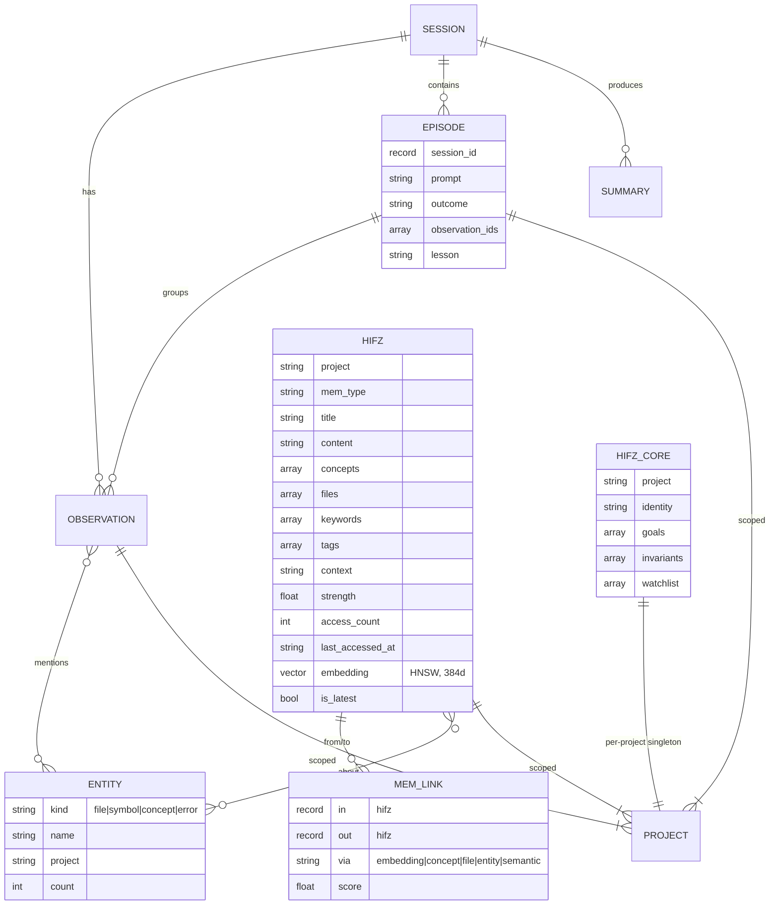
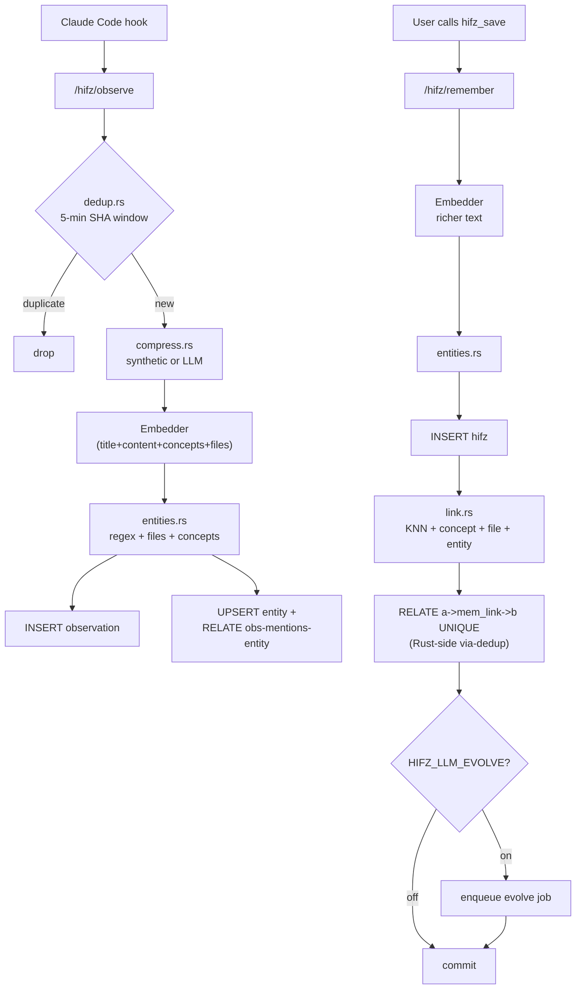
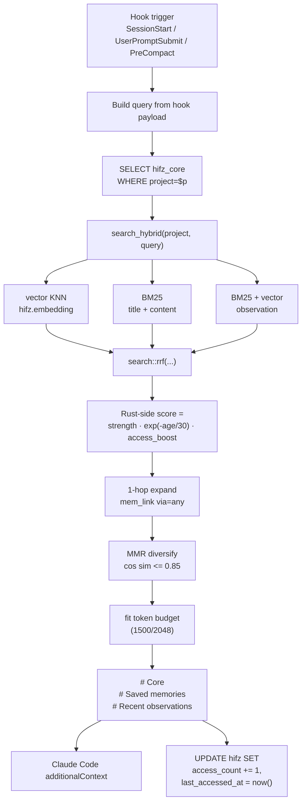
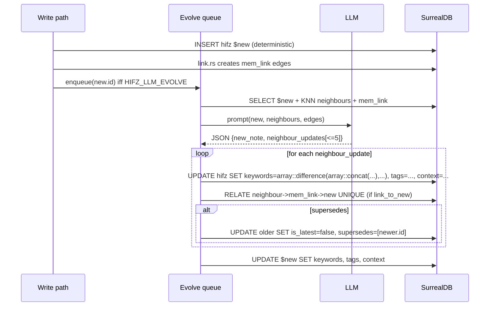

# hifz Memory Architecture — Reference

The *how*. See [`../research/memory-architecture.md`](../research/memory-architecture.md) for the *why*.

This document is the ground truth for hifz's memory model. It is updated at the end of each implementation phase, so sections may describe near-future state — any diagram or table that is ahead of the code is called out with **(planned)**.

## Phase status

| Phase | Status |
|---|---|
| 0 — Docs (this file + research doc) | shipped |
| 1a — Memories embedded, project-scoped; reindex CLI | shipped |
| 1b — Rust-side strength·recency·access scoring; access bump on read | shipped |
| 1c — Query-aware injection + MMR-lite (mem_type + first concept) | shipped |
| 2 — Core / working memory | shipped |
| 3 — Graph linking (`mem_link`) | shipped |
| 4 — Entities + episodes (auto-episode in observe pipeline) | shipped |
| 5 — Memory Evolution (opt-in LLM, `HIFZ_LLM_EVOLVE=true`) | shipped |
| 6 — Eval harness (`memory-bench`) | shipped |
| 7a — `diversify_by_session` memory cap fix + regression test | shipped |
| 7b — `memory-bench` per-miss diagnostics (rank in pool / not-in-pool) | shipped |
| 7c — `SearchConfig` ablation knobs + `--ablate=` CLI flag | shipped |
| 8 — multi-oracle probes + competitor diagnostic in bench | shipped |
| 8.5 — `--preprocess=strip-project` diagnostic flag (bench only) | shipped |
| 9.1 — `SearchConfig::rrf_k` tuning knob, default lowered 60 → 10 | shipped |
| 1c.2 — Cosine-based MMR (successor to MMR-lite) | planned |

---

## 1. Data model



### Tier semantics

- **`observation`** — dense, ephemeral, auto-captured by hooks. Embedded. Feeds entities. Never evolved.
- **`hifz`** — curated, project-scoped long-term memory. Embedded + indexed + linked. May be evolved.
- **`semantic_hifz`** — facts consolidated from sessions (tier 1 of existing consolidation). May be evolved.
- **`procedural_hifz`** — workflows consolidated from observations (tier 3). May be evolved.
- **`episode`** — task-scoped trajectory (new, Phase 4).
- **`hifz_core`** — per-project singleton: identity, goals, invariants, watchlist (new, Phase 2).
- **`mem_link`** — graph edges between memories (new, Phase 3).
- **`entity`** — typed named things mentioned by observations and memories (new, Phase 4).

---

## 2. Write pipeline (observation → memory)



---

## 3. Read / injection pipeline



### Diversification rule

- **Observations** are capped at 3 per `session_id` so a single noisy session can't dominate the results.
- **Memories** have no `session_id`; they are keyed by their own record id during diversification so each memory is its own class. The cap is therefore a no-op for memories. (Phase 7a fixed a bug where every memory was bucketed under the literal string `"memory"`, silently truncating the memory pool to 3 results per query.)

### Scoring formula (Rust-side)

```
score = strength
      * exp(-age_days / 30)                           # Ebbinghaus decay
      * (1.0 + 0.1 * min(access_count, 20))           # usage reinforcement, cap +2.0
```

Forced Rust-side because SurrealDB lacks `math::exp` and `time::diff`. Side benefit: tuning does not require schema changes.

### Query construction by trigger

| Hook | Query string |
|---|---|
| `SessionStart` | project name + titles of N most-recent high-importance observations |
| `UserPromptSubmit` | the prompt text |
| `PreCompact` | titles of observations since last compaction |

---

## 4. Graph linking

Base graph is deterministic. Edges are created at write time.

### Link `via` values

| via | Condition | Score |
|---|---|---|
| `embedding` | KNN cosine distance < 0.25 | `1 - distance` |
| `concept` | Jaccard on `concepts` ≥ 0.3 | Jaccard value |
| `file` | Jaccard on `files` ≥ 0.3 | Jaccard value |
| `entity` | shared entity count ≥ 1 | normalised count |
| `semantic` | proposed by evolution (Phase 5, LLM) | LLM-proposed |

### Edge dedup

`RELATE ... UNIQUE` enforces `(in, out)` uniqueness, not `(in, out, via)`. So per-`via` dedup happens Rust-side: before `RELATE`, `SELECT ... WHERE in=$a AND out=$b AND via=$via`; if present, `UPDATE` with `math::max(score, new)`; otherwise `RELATE`.

### 1-hop expansion at read time

Two queries — `SELECT ->edge->node.*` does *not* return edge fields, so edges and neighbour rows are fetched separately and joined in Rust:

```surql
SELECT in, out, score, via FROM mem_link WHERE in IN $top_ids;

SELECT id, title, content, mem_type, strength, created_at, access_count
FROM hifz WHERE id IN $neighbour_ids AND is_latest = true;
```

Neighbours are scored `seed_score * 0.5 * edge.score`, merged with primary candidates, re-ranked with the same Rust-side formula, then MMR-diversified.

---

## 5. Memory Evolution (opt-in)

Gated by `HIFZ_LLM_EVOLVE=true`. Matches A-MEM §*Memory Evolution*: on a new-memory write, the LLM inspects the new note + its KNN/graph neighbours, then proposes *updates to the neighbours*.



### LLM output contract

```json
{
  "new_note": { "keywords": [...], "tags": [...], "context": "why-this-matters one-liner" },
  "neighbour_updates": [
    {
      "id": "hifz:abc",
      "keywords_add":  [...], "keywords_remove": [...],
      "tags_add":      [...], "tags_remove":     [...],
      "context_rewrite": "…" | null,
      "link_to_new":   { "create": true,  "via": "semantic", "score": 0.0 } | null,
      "supersedes_new": false,
      "superseded_by_new": false
    }
  ]
}
```

### Safety

- Cap `neighbour_updates` to 5 per evolution call.
- JSON-only contract — misbehaving prompts can't corrupt the graph.
- Deterministic path (flag off) is fully functional; Phases 1–4 do not depend on this.

### Triggers

- After write, once the dedup window in `src/dedup.rs` expires.
- During the nightly consolidation tick for memories that skipped evolution.
- Manual: MCP tool `hifz_evolve(memory_id)`.

---

## 6. Phase map

```mermaid
flowchart LR
    P6["Phase 6<br/>Eval harness"]:::foundation
    P1["Phase 1<br/>Retrieval quality"]:::core
    P2["Phase 2<br/>Core memory"]:::core
    P3["Phase 3<br/>Graph linking"]:::graph
    P4["Phase 4<br/>Entities + episodes"]:::graph
    P5["Phase 5<br/>Evolution (LLM opt-in)"]:::llm

    P6 --> P1
    P1 --> P2
    P1 --> P3
    P3 --> P4
    P4 --> P5

    classDef foundation fill:#eef,stroke:#55a
    classDef core fill:#efe,stroke:#5a5
    classDef graph fill:#fef,stroke:#a5a
    classDef llm fill:#ffe,stroke:#aa5
```

## 7. Migrations

Per-phase pattern (verified from `hadith/src/db.rs:54-55` and its `backfill_narrator_hadith_counts`):

1. `DEFINE FIELD IF NOT EXISTS` / `DEFINE INDEX IF NOT EXISTS` at startup (schema init in `src/db.rs` is already idempotent).
2. One-shot backfill via `hifz reindex [--memories|--entities|--links]`.
3. Backfill order: embeddings → entities → links → evolution.
